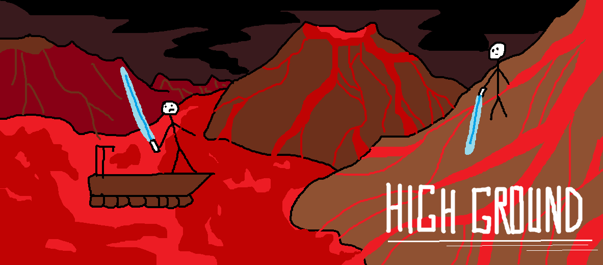

# Temple of the Sun

Revision 1.0.0
By **TEAM HIGHGROUND**

_This GDD is adapted from the GDD Template written by: Benjamin “HeadClot” Stanley and Alec Markarian._

- [Temple of the Sun](#temple-of-the-sun)
  - [Overview](#overview)
    - [Theme / Setting / Genre](#theme--setting--genre)
    - [Core Gameplay Mechanics (Brief)](#core-gameplay-mechanics-brief)
    - [Targeted platforms](#targeted-platforms)
    - [Monetization model (Brief/Document)](#monetization-model-briefdocument)
    - [Project Scope](#project-scope)
    - [Influences (Brief)](#influences-brief)
    - [The Elevator Pitch](#the-elevator-pitch)
    - [Project Description (Brief)](#project-description-brief)
    - [Project Description (Detailed)](#project-description-detailed)
  - [What sets this project apart?](#what-sets-this-project-apart)
    - [Core Gameplay Mechanics (Detailed)](#core-gameplay-mechanics-detailed)
  - [Story and Gameplay](#story-and-gameplay)
    - [Story (Brief)](#story-brief)
    - [Story (Detailed)](#story-detailed)
    - [Gameplay (Brief)](#gameplay-brief)
    - [Gameplay (Detailed)](#gameplay-detailed)
  - [Assets Needed](#assets-needed)
    - [2D](#2d)
    - [3D](#3d)
    - [Sound](#sound)
    - [Code](#code)
    - [NPC Scripts](#npc-scripts)
    - [Animation](#animation)
  - [Schedule](#schedule)
    - [Semester 1](#semester-1)
    - [Semester 2](#semester-2)
    - [Contingency Plan](#contingency-plan)

## Overview

### Theme / Setting / Genre

- 3D Platformer / Aztec-style world

### Core Gameplay Mechanics (Brief)

- Player has the ability to walk (default speed)
- Player has the ability to dash (faster than walking)
  - The dash ability does not timeout, i.e. no stamina.
  - The player may make noise while dashing and alert enemies (*)
- Player has the ability to jump
- Player can pick-up coins distributed throughout levels by passing through the coin
- Basic "throwing" mechanic that can be reused to complete puzzles, attack, etc.
- Heart mechanic / 1UP mechanic - see [gameplay mechanics detailed)](#gameplay-detailed) section for more info

### Targeted platforms

- Windows 10 Desktop OS only.
- A standard Xbox 360-type controller will be required to play.

### Monetization model (Brief/Document)

- We are currently not planning on monetizing our game. 

### Project Scope

- The project will span 2 semesters at MTU (8 months)
- High Level Project Time Planning
  - Semester 1
    - Sprint 1: Develop character physics / create level 1
    - Sprint 2: Continue developing physics and begin testing in first level
    - Sprint 3: Refine character physics based on testing with level 1
  - Semester 2
    - Develop more levels/Debugging
    - Polishing
- 5-Member Team + Ancillary Sound Team
  - Core Programming Team
    - Evan Overweg
      - Team Leader
      - Level Design
    - Riley Mulford
      - Implement world/character mechanics
      - Programming
    - Abri Ingrassia
      - Art
      - Modeling
    - Michael Spoehr
      - Programming
      - Level Design
    - Christian Clemmons
      - Programming
      - Level Design
  - Sound Team

### Influences (Brief)

- Super Mario 64
  - Nintendo 64 Game, released in June 1996
  - This was the 3D platformer that defined the genre. For the time, the game was innovative and helped set the foundation for 3D platformers by showing how to run and jump in a 3D space while still completing objectives but with simplistic controls and a bare story. We will be using the core mechanics of Mario, running and jumping.
- Conker’s Bad Fur Day
  - Nintendo 64 Game, released in March 2001
  - This was a 3D platformer that followed the traditional collectathon formula but add adult humor and graphic violence to the game. This showed that 3D platformers should have their own identity when following the standards of a 3D collectathon platformer. We are creating a story with humorous elements.
- Banjo Kazooie
  - Nintendo 64 Game, released in 1998
  - This game introduced a zany and lovable mascot that people still remember to this day. It was a wacky platformer that showed memorable characters and solid gameplay for the 3D platformer genre. We are going to create a wacky character to star in our platformer.
- Donkey Kong 64
  - Nintendo 64 Game, released in 1999
  - We are going to create a wacky character to star in our platformer.
- Yooka-Laylee
  - PC Game, released in April 2017
  - We are going to create a wacky character to star in our platformer.
- Celeste
  - All modern Consoles/OS’s, released January 2018
  - We are basing the level design off of Celeste, each level will have its own unique feel.
- 1001 Spikes
  - PC Game, released in June 2014
  - We will be using some of the art styles from this game as inspiration, particularly the aztec/jungle themes. We will also be drawing inspiration from the storyline, as a character is searching for something through the jungle.

### The Elevator Pitch

Temple of the Sun is a 3D platformer, styled similarly to games of the N64 era, where the main character is adventuring through the aztec jungle in search of hidden treasure, all the while being challenged by his rival.

### Project Description (Brief)

The goal of this project is to create a throwback 3D platformer reminiscent of classic 3D platformers from the N64 era. The game’s main protagonist will be a Tiger named Reggie who is an explorer. The game’s main antagonist will be a Fox named Foxtail, who is Reggie’s rival explorer.

### Project Description (Detailed)

\<Four Paragraphs or more If needs be>
\<No more than six paragraphs>

## What sets this project apart?

- Simple mechanics, no overcomplicated tutorials, etc.
- We want the levels to speak for themselves, and be fun and entertaining because the level design was done thoughtfully. 
- High quality love letter to classic N64 3D platformer enthusiasts
- A "fresh" take on classic games that are played decades later

### Core Gameplay Mechanics (Detailed)

- Jump
  - The player can jump to overcome obstacles.
  - The player will be able to jump from platform to platform which will be essential to completing each level.
  - The player will be able to jump a fixed height and cannot jump again until landing. 
  - The player will be able to slightly control their movement in the air.
- Walk/Run
  - The player will be able to walk or run throughout levels
  - The player will be able to control their speed in levels so they can be more accurate. The default speed is a walk but if the player holds down the run button they will break into a run allowing them to go faster.
- Pick up items
  - Player will be able to pick up items distributed throughout the levels. 
  - The player collects items by either running, jumping, or walking through the item.
- Throw
  - Player can throw items previously collected to solve puzzles, attack, etc. 
  - By pressing “throw” button, player will toss item forward at target.
- Coins / Points
  - The player will gain points by picking up coins, beating the level quickly, and not dying.
  - Coins only influence the points earned at the end of a level and allow the player to obtain 1UPs. They have no other purpose, keeping the game mechanics simple and straightforward for the player. 
- Hearts and 1UPS
  - The player begins with 3 hearts. Each source of damage results in the reduction of 1 heart.
  - If the player runs out of hearts, they die. This results in the loss of a single 1UP and the restoration of all 3 hearts. If the player runs out of 1UPs, the game is over. 
  - The player starts with 4 1UPs, but they can be obtained by collecting 100 coins. 1UPs are awarded based on the coins collected at the end of a level automatically. 

## Story and Gameplay

### Story (Brief)

Reggie (Tiger) goes to the temple in search of hidden treasure. Rival Foxtail (Fox) tries to stop him.

### Story (Detailed)

Ever since Reggie was a child, he has had a desire to go on adventures. The young tiger would spare no one the privilege of hearing his dreams of travel and finding countless treasures, including his all-but-equal Foxtail. As Reggie’s dreams grew larger, Foxtail became angry and swore an oath to prevent Reggie from ever fulfilling his dreams. In fact, Foxtail works night and day to not only stop Reggie from finding the secrets locked away in forgotten chambers, but secure the riches for himself. After years of searching, Reggie has finally secured the location of the infamous Temple of the Sun - known to house the greatest score any adventurer could dream of. In a race against time, Reggie must survive the trials The Temple has in store from him and find the hidden treasures before his rival Foxtail. 

### Gameplay (Brief)

The player will run, jump and fight their way through numerous levels. The player can pick up coins which add points to their score. They can pick up various objects and throw them or set them down, allowing for a single mechanic to interact with puzzles, attack, place things in backpack, etc. The game uses a basic 3-heart with 1UP system for player lives.

### Gameplay (Detailed)

The core gameplay for Temple of the Sun revolves around the player running and jumping through each level towards the end. Running can be held an indefinite amount of time without stopping, i.e. there is no stamina mechanic. There will be obstacles to impede the player’s progress. Spike pits, flame traps, boulder traps, arrow traps, temple guardians, bottomless pits, trap doors, etc. Each damage source will deal 1 heart of damage (out of three total). The player can pick up hearts to recover lost hearts. 

The player will be scored at the end of each level, points are awarded for picking up coins, finding collectibles, and are taken away for losing hearts or dying in a level. There is also potential for awarding points for unusual achievements (like taking exactly 343 seconds to finish a level, or opening all doors by throwing a barrel at them). 

## Assets Needed

### 2D

- Textures
  - Jungle
  - Temple
  - Bricks
  - Heart display
  - Coins
- Heightmap data
  - If used, its going to be smoothed random data to make the terrain interesting. This item is still TBD.

### 3D

- Characters List
  - Reggie (Protagonist)
    - A tiger
  - Foxtail (Antagonist)
    - A fox
- Environmental Art Lists
  - Jungle
    - Trees (a few varieties) 
    - Bushes (a few varieties) 
    - Rocks (a few varieties) 
    - Vines
    - Swamps
    - River
    - Wood (for bridges)
  - Temple
    - Torches
    - Pitfalls
    - Boulders
    - Walls, floor
    - Bricks
  - Example #3
  - etc.

### Sound

- Sound List (Ambient)
  - Outside
    - Level 1 - Sounds of a jungle
      - Birds
      - Insects buzzing
      - Wind
      - Sticks snapping
    - Level 2 - further levels have yet to be designed.
  - Inside
    - Level 1 
    - Level 2 - further levels have yet to be designed.
- Sound List (Player)
  - Character Movement Sound List
    - Jumping causes a thud noise when landing
    - Picking up sound
    - Throwing sound
    - Footsteps should be relatively quiet, considering player is a feline. Recommendations: light crunching of leaves?
    - Footsteps are louder when running (same asset, but played louder and more frequently)
  - Character Hit / Collision Sound list
    - Reggie will either make a sound/ say “ouch”
    - Generic hurt sound
  - Character on Injured / Death sound list
    - Generic death sound
    - Possibly Foxtail taunts
- Sound List (Other)
  - Level completed sound effect
  - Game over sound effect (running out of 1UPs)
  - We would like the game to have background music

### Code

- PlayerController: Handles user interactions with player
- CameraController: Handles the in-game camera view

### NPC Scripts

- Limited interactions with Foxtail in Level 1
- More interactions (ending with a final boss battle, for later levels)

### Animation

- Environment Animations
  - Score will appear at the end of level
  - Flames on torches
  - Boulders rolling
  - Arrows flying
  - Trap door opening
- Character Animations
  - Reggie (Tiger)
    - Running
    - Jumping
    - Picking up objects
    - Throwing objects
  - Enemies
    - Moving back and forth

## Schedule

### Semester 1

- Sprint 1 (3 weeks)
  - Implement Walking/Running Character Mechanic
  - Implement Jumping Character Mechanic
  - Begin design on Level 1
  - Create Character Models
- Sprint 2 (3 weeks)
  - Implement Picking Up/Throwing Character Mechanic
  - Finish Designing Level 1 and begin implementation (include sounds here)
  - Create Essential Assets (i.e. textures for hearts, coins, etc.)
  - Implement Coins/Hearts/1UP mechanics
- Sprint 3 (3 weeks)
  - Refinement of Character Mechanics based on testing with Level 1
  - Begin NPC scripts
  - Testing and debugging
  - Create End of Level Screen
  - Create menus

### Semester 2

- Develop more levels, and do polishing/debugging

**Expected Release: Spring 2019** 

### Contingency Plan

In the event that the above plan is too optimistic and we must cut back the features in the game in order to meet our release date, these are the features that we plan to cut in order of priority (roughly):

1. Remove the picking up/throwing items mechanic
2. Scale back number of levels and size
3. Remove direct interactions with non-Foxtail NPC’s
4. Remove direct interactions with Foxtail
5. Reduce amount of sound effects
6. Remove Coins/scoring system
7. Remove Foxtail entirely
8. Remove heart mechanics. Make all damage events insta-kill.
